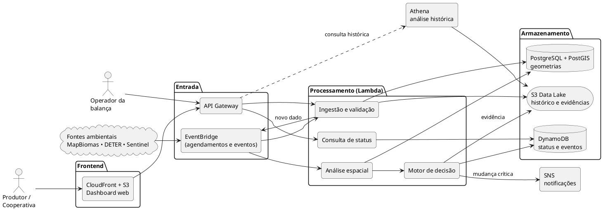

# Documento de Arquitetura (v1.0)

**Projeto**: Lavoura Inteligente — Rastreabilidade Agrícola e Conformidade EUDR<br>
**Fase**: Elaboração<br>
**Data**: 01/10/2026<br>
**Status**: Em revisão

## 1. Visão geral

A arquitetura é **orientada a eventos** e combina processamento serverless,
armazenamento operacional rápido, data lake histórico e uma camada especializada em
geoprocessamento. O princípio central é **pré-processar** os dados complexos para que a
consulta na balança seja apenas a leitura de um status já calculado.

DynamoDB, S3, Lambda e API Gateway continuam sendo o núcleo pedido pelo Case 6.
EventBridge, SNS, Athena e PostGIS complementam a arquitetura para torná-la realista e
defensável.

## 2. Diagrama de alto nível



## 3. Papel de cada serviço

| Serviço | Função | Por que entra | Exemplo no case |
| -- | -- | -- | -- |
| Amazon API Gateway | Porta de entrada das APIs. | Recebe chamadas do frontend, da balança e de integrações; aplica autenticação, limites de requisição e métricas. | `GET /talhoes/{id}/status`, `POST /romaneios`, `POST /talhoes` |
| AWS Lambda | Computação serverless. | Executa ingestão, validação e regras sem servidor ligado 24 horas. | Validar um GeoJSON, atualizar o status de um talhão. |
| Amazon DynamoDB | Banco operacional de baixa latência. | Guarda o que precisa ser lido rápido: status atual e eventos recentes por talhão. | Consultar o status no momento da recepção do lote. |
| Amazon S3 | Data lake e armazenamento de objetos. | Guarda arquivos grandes e históricos a baixo custo: GeoJSON, KML, Parquet, relatórios, evidências. | Manter anos de evidências sem custo de banco operacional. |
| Amazon Athena | SQL sobre o S3. | Análises sob demanda sem cluster analítico permanente. | Alertas históricos por município, período ou produtor. |
| Amazon EventBridge | Barramento de eventos e agendador. | Desacopla ingestão, análise e notificação; agenda coletas periódicas. | Novo alerta ambiental dispara análise, atualização e notificação. |
| Amazon SNS | Notificações. | Distribui alertas para e-mail, SMS ou webhooks. | Avisar quando um talhão muda de APROVADO para REVISÃO. |
| PostgreSQL + PostGIS (Amazon RDS) | Banco relacional e geoespacial. | Entidades relacionais, geometrias e operações espaciais indexadas. | `ST_Intersects` entre o polígono do talhão e uma camada de alerta. |
| Amazon Cognito | Autenticação de usuários. | Login, MFA e grupos por perfil integrados ao API Gateway. | Operador da balança só acessa a consulta de status. |
| CloudFront + S3 | Hospedagem do frontend. | Entrega HTTPS do dashboard estático. | Mapa com talhões verdes, amarelos e vermelhos. |
| CloudWatch + CloudTrail | Observabilidade e auditoria. | Métricas, logs, alarmes e trilha de ações na conta AWS. | Alarme de falha na ingestão; registro de mudanças de permissão. |

## 4. Hot storage x cold storage

Não colocamos todos os dados no mesmo banco. Cada camada guarda apenas o que precisa.

| Camada | Tecnologia | O que guardar |
| -- | -- | -- |
| Hot data | DynamoDB | Status atual, eventos recentes, chaves de consulta rápida, dados usados na balança. |
| Geoespacial | PostgreSQL/PostGIS | Polígonos, relacionamento produtor/fazenda/talhão e consultas espaciais. |
| Cold data | S3 + Athena | Histórico, arquivos brutos, evidências antigas, Parquet e dados de auditoria. |

## 5. Modelagem do DynamoDB

O identificador do talhão é a *partition key*; a *sort key* ordena o item de status e os
eventos daquele talhão.

```text
PK = TALHAO#10023    SK = STATUS
PK = TALHAO#10023    SK = EVT#2026-09-20#MAPBIOMAS
PK = TALHAO#10023    SK = EVT#2026-09-21#DETER
PK = TALHAO#10023    SK = EVT#2026-09-22#SENTINEL
PK = LOTE#2026-09-00128   SK = META
```

O item `STATUS` contém apenas o necessário para a resposta rápida: status, motivo,
versão do polígono, datasets usados, data do cálculo e validade. Um índice secundário
por produtor permite listar todos os talhões de um produtor sem *Scan*.

!!! warning "Risco técnico: hot partition"
    Se muitas escritas se concentrarem na mesma partition key, pode surgir uma hot
    partition. Como cada talhão recebe poucas escritas por dia, o risco é baixo no
    cenário de referência; em escala maior, a chave pode usar sharding ou buckets de
    tempo.

## 6. Geoprocessamento

O diferencial técnico do produto é a análise espacial: comparar a geometria de cada
talhão com camadas ambientais e produzir evidências de interseção ou proximidade.

```text
POLÍGONO DO TALHÃO  ∩  CAMADA / ALERTA AMBIENTAL
        ↓
interseção? área afetada? distância?
        ↓
ATUALIZAÇÃO DO STATUS + EVIDÊNCIA
```

```sql
SELECT a.alerta_id,
       ST_Area(ST_Intersection(a.geom, t.geom)::geography) AS area_afetada_m2
FROM alertas a
JOIN talhoes t ON ST_Intersects(a.geom, t.geom)
WHERE t.talhao_id = :talhao_id
  AND a.data_deteccao > DATE '2020-12-31';
```

Para testes pequenos, Shapely/GeoPandas em Lambda são suficientes. Para a plataforma,
PostGIS oferece índices espaciais (GiST) e consultas persistentes mais eficientes.

## 7. Regra de status

| Situação | Status |
| -- | -- |
| Polígono válido, nenhuma interseção com alerta posterior à data de corte | APROVADO |
| Polígono ausente/inválido, alerta próximo (buffer) sem interseção, dado vencido ou fonte indisponível | REVISÃO |
| Interseção com alerta de desmatamento posterior a 31/12/2020 | BLOQUEADO |

Um lote com vários talhões assume o **pior** status entre eles. A revisão humana pode
alterar o status com justificativa, sem apagar a evidência original.

## 8. Fluxos principais

| Fluxo | Caminho |
| -- | -- |
| Cadastro de talhão | Frontend → API Gateway → Lambda → validação da geometria → PostGIS + S3 → DynamoDB (status inicial). |
| Novo dado ambiental | EventBridge (agendado) → Lambda de ingestão → S3/PostGIS → evento → análise espacial → DynamoDB → SNS se houver mudança crítica. |
| Chegada de um lote | Balança/Frontend → API Gateway → Lambda → leitura do STATUS no DynamoDB → APROVADO/REVISÃO/BLOQUEADO. |
| Consulta histórica | Dashboard → API → Athena sobre S3 e/ou PostGIS → relatório ou visualização. |
| Auditoria | Seleção de produtor/lote → polígonos versionados, eventos e evidências → pacote auditável no S3. |

## 9. Por que cloud e serverless

- **Elasticidade**: pouco tráfego fora da safra e picos na colheita.
- **Serverless**: Lambdas só executam quando há evento; sem CPU ociosa.
- **Armazenamento escalável**: S3 cresce de gigabytes a terabytes sem mudança estrutural.
- **Desacoplamento**: EventBridge permite evoluir ingestão, análise e notificação separadamente.
- **Baixa latência**: DynamoDB atende a consulta da balança em milissegundos.
- **Histórico barato**: dados antigos saem do banco operacional e vão para S3 + Athena.
- **Serviços gerenciados**: menos esforço com servidores, patches e capacidade.

## 10. Estratégia de custo (US$ 1.500/mês)

- DynamoDB apenas para dados operacionais (modo sob demanda).
- Histórico em S3 no formato Parquet, particionado por data e região.
- Athena sob demanda, sem cluster analítico permanente.
- Lambdas por evento em vez de servidores dedicados.
- PostGIS com instância pequena, guardando só o que precisa de consulta espacial.
- Lifecycle policies no S3 para mover dados antigos a classes mais baratas.
- VPC Endpoints em vez de NAT Gateway para acesso privado a S3 e DynamoDB.

O valor final deve ser validado na AWS Pricing Calculator com o cenário de referência.

## 11. Riscos e pontos de atenção

| Risco | Impacto | Mitigação |
| -- | -- | -- |
| Hot partition no DynamoDB | Latência/throttling | Distribuir chaves; sharding ou buckets de tempo se necessário. |
| Processamento geoespacial pesado | Lambda cara/lenta | Pré-processar dados; usar PostGIS com índices espaciais. |
| Arquivo geográfico inválido | Análise incorreta | Validar CRS, geometria e formato na ingestão. |
| Dependência de fontes externas | Dados atrasam ou mudam | Versionar datasets; registrar data e origem de cada evidência. |
| Consulta histórica cara | Athena cobra por dados varridos | Particionar e usar Parquet comprimido. |
| Regra simplificada | Status lido como certeza jurídica | Chamar de status de risco e manter revisão humana com evidências. |

## 12. MVP

- Cadastro de produtor, fazenda e talhão.
- Upload de GeoJSON do talhão.
- Uma camada ambiental simulada ou dataset público recortado.
- Interseção com PostGIS ou Shapely.
- Status APROVADO / REVISÃO / BLOQUEADO no DynamoDB.
- Arquivo original e evidências no S3.
- Dashboard simples com mapa e lista de talhões.
- Endpoint de consulta na balança.
- Notificação via SNS quando o status muda.

## 13. Histórico e aprovação

| Versão | Data | Status | Descrição | Autor(es) |
| -- | -- | -- | -- | -- |
| 1.0 | 01/10/2026 | Em revisão | Arquitetura para rastreabilidade agrícola e conformidade EUDR. | Equipe do projeto |

| Papel aprovador | Nome | Data | Decisão |
| -- | -- | -- | -- |
| Arquiteto de Soluções | | | Pendente |
| Professor responsável | | | Pendente |
