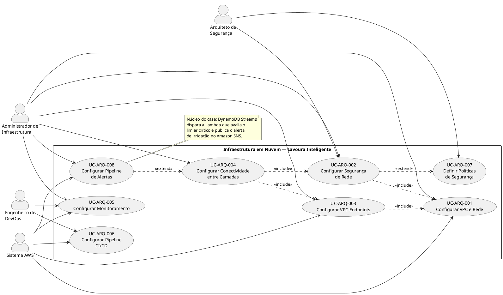

# Casos de Uso Arquiteturais

**LAVOURA INTELIGENTE — INFRAESTRUTURA EM NUVEM AWS**

| Informação do Documento | |
| -- | -- |
| Projeto | Lavoura Inteligente — Plataforma de Telemetria Agrícola |
| Documento | Modelo de Casos de Uso Arquiteturais |
| Versão | 1.0 |
| Data | 08/09/2026 |
| Status | Em Desenvolvimento |
| Responsável | Joao Vitor Donda, Caique Rechuan e Joao Gabriel Meirelles |
| Disciplina | PC_ADS_26.2_8001_II — Case 6: AgTech "Lavoura Inteligente" |

## 1. Introdução

### 1.1. Propósito

Este documento descreve os Casos de Uso Arquiteturais para a infraestrutura em nuvem
AWS da plataforma Lavoura Inteligente. Os casos de uso arquiteturais focam em
requisitos de infraestrutura, segurança, operações e governança, diferentemente dos
casos de uso funcionais que descrevem interações de usuários finais com o sistema.

### 1.2. Escopo

Os casos de uso arquiteturais abrangem a configuração, operação e manutenção da
infraestrutura AWS, incluindo:

- Rede (VPC, sub-redes, rotas, endpoints)
- Segurança (Security Groups, NACLs, IAM)
- Conectividade entre camadas (ALB, EC2, RDS, Lambda)
- Pipeline de ingestão e alertas orientado a eventos (API Gateway, Lambda, DynamoDB
  Streams, SNS)
- Integração com serviços gerenciados (DynamoDB, S3, Secrets Manager)
- Automação e deploy (CI/CD)

Como o time do projeto é composto por 3 integrantes, os atores abaixo representam
papéis desempenhados pelo grupo, e não cargos dedicados.

### 1.3. Referências

- Documento de Visão — Lavoura Inteligente (v1.0)
- Documento de Requisitos Suplementares — Lavoura Inteligente (v1.0)
- AWS Well-Architected Framework
- Amazon VPC Documentation

## 2. Visão Geral dos Casos de Uso

### 2.1. Atores

| Ator | Descrição | Responsabilidades |
| -- | -- | -- |
| Administrador de Infraestrutura | Profissional responsável por configurar e gerenciar a infraestrutura AWS. | Criar VPC, sub-redes, security groups, endpoints. |
| Engenheiro de DevOps | Profissional responsável por automação e CI/CD. | Configurar pipelines, deploys, rollbacks. |
| Sistema AWS | Serviços gerenciados da AWS (DynamoDB, S3, SNS etc.). | Prover serviços, endpoints, logs, eventos. |
| Arquiteto de Segurança | Profissional responsável por políticas de segurança e compliance. | Definir políticas IAM, criptografia, auditoria. |

### 2.2. Diagrama de Casos de Uso

## 3. Especificação dos Casos de Uso

### UC-ARQ-001: Configurar VPC e Rede Lavoura Inteligente

| Elemento | Especificação |
| -- | -- |
| Identificador | UC-ARQ-001 |
| Nome | Configurar VPC e Rede Lavoura Inteligente |
| Versão | 1.0 |
| Data | 08/09/2026 |
| Status | Aprovado |
| Ator Principal | Administrador de Infraestrutura |
| Ator Secundário | Sistema AWS |
| Pré-condição | 1. Conta AWS ativa. 2. Permissões IAM para criar VPC, sub-redes, IGW, NAT Gateway, Route Tables. |
| Pós-condição | 1. VPC criada com CIDR 10.0.0.0/16. 2. 4 sub-redes criadas (2 públicas, 2 privadas) em 2 AZs. 3. Internet Gateway anexado. 4. NAT Gateways configurados. 5. Route Tables configuradas. |

| Fluxo Principal | Passos |
| -- | -- |
| 1 | Administrador acessa o Console AWS. |
| 2 | Navega até o serviço VPC. |
| 3 | Cria VPC com CIDR 10.0.0.0/16 e habilita DNS hostnames. |
| 4 | Cria 2 sub-redes públicas (uma por AZ) com CIDR 10.0.1.0/24 e 10.0.2.0/24. |
| 5 | Cria 2 sub-redes privadas (uma por AZ) com CIDR 10.0.3.0/24 e 10.0.4.0/24. |
| 6 | Cria e anexa Internet Gateway à VPC. |
| 7 | Cria NAT Gateways (um por AZ) nas sub-redes públicas. |
| 8 | Configura Route Table pública: 10.0.0.0/16 → local, 0.0.0.0/0 → IGW. |
| 9 | Configura Route Table privada: 10.0.0.0/16 → local, 0.0.0.0/0 → NAT Gateway. |
| 10 | Associa sub-redes públicas à Route Table pública. |
| 11 | Associa sub-redes privadas à Route Table privada. |
| 12 | Valida conectividade: instância pública → Internet, instância privada → NAT. |

| Fluxos Alternativos | Descrição |
| -- | -- |
| Alt 1 | CIDR da VPC conflita com outra VPC ou rede on-premises (erro de criação). |
| Alt 2 | Limite de VPCs por região é atingido (5 VPCs por região). |
| Alt 3 | Permissões IAM insuficientes (erro de autorização). |
| Alt 4 | NAT Gateway falha (instância privada perde acesso à Internet). |

| Requisitos Não-Funcionais | Métrica |
| -- | -- |
| Desempenho | VPC criada e configurada em < 15 min. |
| Disponibilidade | Multi-AZ com 2 AZs (redundância). |
| Segurança | Sub-redes privadas sem rota direta para Internet. |
| Custo | NAT Gateway: ~US$ 0,045/hora por AZ (~US$ 64/mês para 2 AZs). |

| Riscos | Mitigação |
| -- | -- |
| Endereçamento conflitante | Planejar CIDR com folga (10.0.0.0/16). |
| Custo elevado do NAT Gateway | Avaliar uso de NAT Instance (mais barato, menos gerenciado). |
| Erro de roteamento | Testar conectividade com ping ou traceroute. |

**Referências**: Amazon VPC Documentation; AWS Well-Architected — Reliability Pillar.

---

### UC-ARQ-002: Configurar Segurança de Rede Lavoura Inteligente

| Elemento | Especificação |
| -- | -- |
| Identificador | UC-ARQ-002 |
| Nome | Configurar Segurança de Rede Lavoura Inteligente |
| Versão | 1.0 |
| Data | 08/09/2026 |
| Status | Aprovado |
| Ator Principal | Administrador de Infraestrutura |
| Ator Secundário | Arquiteto de Segurança, Sistema AWS |
| Pré-condição | 1. VPC e sub-redes criadas (UC-ARQ-001). 2. IAM configurado. |
| Pós-condição | 1. Security Groups configurados para cada camada. 2. NACLs configuradas. 3. IAM roles definidas para serviços. |

| Fluxo Principal | Passos |
| -- | -- |
| 1 | Administrador acessa o Console AWS. |
| 2 | Navega até Security Groups. |
| 3 | Cria SG-ALB com regras de entrada: portas 80 e 443 (0.0.0.0/0). |
| 4 | Cria SG-EC2-Portal com regras de entrada: porta 8000 (origem: SG-ALB). |
| 5 | Cria SG-RDS com regras de entrada: porta 5432 (origem: SG-EC2-Portal). |
| 6 | Cria SG-Lambda com regras de saída: DynamoDB, S3, SNS. |
| 7 | Cria NACLs para sub-redes públicas e privadas (camada extra de segurança). |
| 8 | Define IAM roles para EC2, Lambda e RDS. |

| Fluxos Alternativos | Descrição |
| -- | -- |
| Alt 1 | Porta 8000 exposta acidentalmente → revisão das regras. |
| Alt 2 | IAM role com permissões excessivas → aplicar princípio de menor privilégio. |

| Requisitos Não-Funcionais | Métrica |
| -- | -- |
| Segurança | Princípio de menor privilégio implementado. |
| Segurança | Criptografia em trânsito (TLS 1.3). |
| Compliance | Conformidade com a LGPD. |

| Riscos | Mitigação |
| -- | -- |
| Security Groups permissivos | Revisão periódica das regras. |
| Acesso não autorizado | MFA obrigatório para administradores. |

**Referências**: AWS Security Best Practices; AWS Well-Architected — Security Pillar.

---

### UC-ARQ-003: Configurar VPC Endpoints Lavoura Inteligente

| Elemento | Especificação |
| -- | -- |
| Identificador | UC-ARQ-003 |
| Nome | Configurar VPC Endpoints Lavoura Inteligente |
| Versão | 1.0 |
| Data | 08/09/2026 |
| Status | Aprovado |
| Ator Principal | Administrador de Infraestrutura |
| Ator Secundário | Sistema AWS (DynamoDB, S3, Secrets Manager) |
| Pré-condição | 1. VPC e sub-redes privadas criadas (UC-ARQ-001). 2. IAM configurado. |
| Pós-condição | 1. DynamoDB Gateway Endpoint configurado. 2. S3 Interface Endpoint configurado. 3. Secrets Manager Interface Endpoint configurado. 4. Políticas de endpoint restritivas aplicadas. |

| Fluxo Principal | Passos |
| -- | -- |
| 1 | Administrador acessa o Console AWS. |
| 2 | Navega até VPC Endpoints. |
| 3 | Cria Gateway Endpoint para DynamoDB (tipo: Gateway). |
| 4 | Associa às sub-redes privadas (10.0.3.0/24, 10.0.4.0/24). |
| 5 | Atualiza a Route Table privada com rota para o DynamoDB. |
| 6 | Cria Interface Endpoint para S3 (tipo: Interface). |
| 7 | Cria Interface Endpoint para Secrets Manager (tipo: Interface). |
| 8 | Aplica políticas de endpoint para restringir acesso a buckets e segredos específicos. |
| 9 | Valida conectividade: EC2 → DynamoDB, Lambda → S3. |

| Fluxos Alternativos | Descrição |
| -- | -- |
| Alt 1 | Serviço não suporta Gateway Endpoint (ex.: Secrets Manager) → usar Interface Endpoint. |
| Alt 2 | Política de endpoint bloqueia acesso → revisar e ajustar. |

| Requisitos Não-Funcionais | Métrica |
| -- | -- |
| Segurança | Tráfego não sai da VPC. |
| Custo | Interface Endpoints: US$ 0,01/hora cada (~US$ 14/mês). |
| Desempenho | Latência reduzida em relação ao acesso via Internet. |

| Riscos | Mitigação |
| -- | -- |
| Custo elevado | Usar Gateway Endpoint para os serviços suportados (DynamoDB, S3). |
| Políticas restritivas | Testar políticas com usuários específicos antes de aplicar. |

**Referências**: AWS VPC Endpoints Documentation; AWS PrivateLink Documentation.

---

### UC-ARQ-004: Configurar Conectividade entre Camadas Lavoura Inteligente

| Elemento | Especificação |
| -- | -- |
| Identificador | UC-ARQ-004 |
| Nome | Configurar Conectividade entre Camadas Lavoura Inteligente |
| Versão | 1.0 |
| Data | 08/09/2026 |
| Status | Aprovado |
| Ator Principal | Administrador de Infraestrutura |
| Ator Secundário | Engenheiro de DevOps |
| Pré-condição | 1. VPC e sub-redes criadas (UC-ARQ-001). 2. Security Groups configurados (UC-ARQ-002). 3. VPC Endpoints configurados (UC-ARQ-003). |
| Pós-condição | 1. Application Load Balancer (ALB) configurado. 2. EC2 (portal administrativo) configurada e comunicando com o ALB. 3. RDS acessível apenas pela EC2. 4. Lambda de ingestão acessando DynamoDB e S3 via endpoints. |

| Fluxo Principal | Passos |
| -- | -- |
| 1 | Administrador acessa o Console AWS. |
| 2 | Configura o Application Load Balancer (ALB) na sub-rede pública. |
| 3 | Configura o listener: porta 443 (HTTPS) → porta 8000 (EC2). |
| 4 | Configura o Target Group com a EC2 do portal (porta 8000). |
| 5 | Cria o Launch Template para a EC2 do portal com User Data (Gunicorn, Nginx). |
| 6 | Configura o Auto Scaling Group com mínimo de 2 instâncias (Multi-AZ). |
| 7 | Configura o RDS PostgreSQL em Multi-AZ com o Security Group SG-RDS. |
| 8 | Configura a Lambda de ingestão com VPC (sub-redes privadas) e os VPC Endpoints. |
| 9 | Testa o fluxo completo: ALB → EC2 → RDS, Lambda → DynamoDB. |

| Fluxos Alternativos | Descrição |
| -- | -- |
| Alt 1 | EC2 não alcança RDS (erro de Security Group) → revisar regras. |
| Alt 2 | Lambda não acessa DynamoDB (erro de endpoint) → revisar IAM. |

| Requisitos Não-Funcionais | Métrica |
| -- | -- |
| Disponibilidade | 99,95% (Multi-AZ + ALB + Auto Scaling). |
| Desempenho | Latência p95 < 80ms para a ingestão de telemetria. |
| Segurança | Comunicação entre camadas via rede privada. |

| Riscos | Mitigação |
| -- | -- |
| ALB como ponto único de falha | O ALB é gerenciado e altamente disponível. |
| Auto Scaling mal configurado | Definir alarmes do CloudWatch para o escalonamento. |

**Referências**: AWS ALB Documentation; AWS Auto Scaling Documentation.

---

### UC-ARQ-005: Configurar Monitoramento Lavoura Inteligente

| Elemento | Especificação |
| -- | -- |
| Identificador | UC-ARQ-005 |
| Nome | Configurar Monitoramento Lavoura Inteligente |
| Versão | 1.0 |
| Data | 08/09/2026 |
| Status | Aprovado |
| Ator Principal | Administrador de Infraestrutura |
| Ator Secundário | Engenheiro de DevOps |
| Pré-condição | 1. VPC e recursos configurados. |
| Pós-condição | 1. Dashboards do CloudWatch configurados. 2. Alarmes definidos. 3. Logs centralizados. |

| Fluxo Principal | Passos |
| -- | -- |
| 1 | Administrador acessa o Console AWS. |
| 2 | Navega até o CloudWatch. |
| 3 | Cria um Dashboard com métricas: CPU, memória, latência, eventos de telemetria por segundo. |
| 4 | Configura alarmes: CPU > 80%, latência > 80ms, taxa de erro da ingestão > 1%. |
| 5 | Configura o CloudWatch Logs para EC2, RDS e Lambda. |
| 6 | Cria Log Groups centralizados. |
| 7 | Define métricas customizadas para a ingestão de telemetria e para o motor de alertas. |

| Requisitos Não-Funcionais | Métrica |
| -- | -- |
| Observabilidade | 100% de cobertura de logs. |
| Resposta a incidentes | Tempo de resposta < 15 min. |

**Referências**: AWS CloudWatch Documentation; AWS Well-Architected — Operational Excellence.

---

### UC-ARQ-006: Configurar Pipeline CI/CD Lavoura Inteligente

| Elemento | Especificação |
| -- | -- |
| Identificador | UC-ARQ-006 |
| Nome | Configurar Pipeline CI/CD Lavoura Inteligente |
| Versão | 1.0 |
| Data | 08/09/2026 |
| Status | Aprovado |
| Ator Principal | Engenheiro de DevOps |
| Ator Secundário | Sistema AWS (CodePipeline, CodeBuild, CodeDeploy) |
| Pré-condição | 1. Código da API no repositório GitHub. 2. EC2 e RDS configurados. |
| Pós-condição | 1. Pipeline automatizado funcionando. 2. Deploy em menos de 10 minutos. 3. Rollback em menos de 5 minutos. |

| Fluxo Principal | Passos |
| -- | -- |
| 1 | Engenheiro acessa o Console AWS. |
| 2 | Configura o CodePipeline com Source (GitHub), Build (CodeBuild) e Deploy (CodeDeploy). |
| 3 | Configura o CodeBuild com buildspec.yml (instalação de dependências, testes). |
| 4 | Configura o CodeDeploy com AppSpec.yml (deploy do portal na EC2). |
| 5 | Configura rollback automático em caso de falha. |
| 6 | Testa o pipeline com um commit no branch principal. |
| 7 | Configura aprovação manual para o ambiente de produção. |

| Fluxos Alternativos | Descrição |
| -- | -- |
| Alt 1 | Build falha → notificação via SNS. |
| Alt 2 | Deploy falha → rollback automático. |

| Requisitos Não-Funcionais | Métrica |
| -- | -- |
| Desempenho | Deploy em menos de 10 minutos. |
| Confiabilidade | Rollback em menos de 5 minutos. |

**Referências**: AWS CodePipeline Documentation; AWS CodeBuild Documentation.

---

### UC-ARQ-007: Definir Políticas de Segurança Lavoura Inteligente

| Elemento | Especificação |
| -- | -- |
| Identificador | UC-ARQ-007 |
| Nome | Definir Políticas de Segurança Lavoura Inteligente |
| Versão | 1.0 |
| Data | 08/09/2026 |
| Status | Aprovado |
| Ator Principal | Arquiteto de Segurança |
| Ator Secundário | Administrador de Infraestrutura |
| Pré-condição | 1. Conta AWS configurada. 2. IAM configurado. |
| Pós-condição | 1. Políticas IAM definidas. 2. Criptografia configurada. 3. Conformidade com a LGPD. |

| Fluxo Principal | Passos |
| -- | -- |
| 1 | Arquiteto de Segurança define as políticas IAM (princípio de menor privilégio). |
| 2 | Configura MFA obrigatório para todos os usuários administrativos. |
| 3 | Configura criptografia em repouso: RDS (AES-256), S3 (AES-256), DynamoDB (AES-256). |
| 4 | Configura criptografia em trânsito: TLS 1.3 (ALB), API Gateway. |
| 5 | Configura o Secrets Manager para as credenciais do banco de dados. |
| 6 | Define a política de rotação de chaves (a cada 90 dias). |
| 7 | Configura o CloudTrail para auditoria de acessos. |
| 8 | Valida a conformidade dos dados de produtores e agrônomos com a LGPD. |

| Requisitos Não-Funcionais | Métrica |
| -- | -- |
| Segurança | Criptografia AES-256 em repouso. |
| Segurança | TLS 1.3 em trânsito. |
| Compliance | Conformidade com a LGPD. |

| Riscos | Mitigação |
| -- | -- |
| Chaves comprometidas | Rotação a cada 90 dias. |
| Acesso não autorizado | MFA e auditoria. |

**Referências**: AWS IAM Documentation; AWS KMS Documentation; Lei Geral de Proteção de Dados (LGPD).

---

### UC-ARQ-008: Configurar Pipeline de Alertas Lavoura Inteligente

> Caso de uso adicionado a este case, sem equivalente no exemplo de referência, para
> cobrir o requisito central da plataforma: transformar a telemetria em alerta de
> irrigação em tempo real.

| Elemento | Especificação |
| -- | -- |
| Identificador | UC-ARQ-008 |
| Nome | Configurar Pipeline de Alertas Lavoura Inteligente |
| Versão | 1.0 |
| Data | 08/09/2026 |
| Status | Aprovado |
| Ator Principal | Administrador de Infraestrutura |
| Ator Secundário | Sistema AWS (DynamoDB Streams, Lambda, SNS) |
| Pré-condição | 1. Tabela DynamoDB de telemetria configurada (UC-ARQ-003, UC-ARQ-004). 2. Limiares críticos de irrigação definidos por cultura. |
| Pós-condição | 1. DynamoDB Streams habilitado na tabela de telemetria. 2. Função Lambda de avaliação de limiares associada ao stream. 3. Tópico SNS de alertas configurado e assinado pelos canais dos produtores. 4. Fila de mensagens mortas (DLQ) configurada para falhas de processamento. |

| Fluxo Principal | Passos |
| -- | -- |
| 1 | Administrador acessa o Console AWS. |
| 2 | Habilita o DynamoDB Streams na tabela de telemetria (New Image). |
| 3 | Cria a função Lambda de avaliação de alertas e a associa ao stream como *event source*. |
| 4 | Configura a Lambda para comparar cada leitura ao limiar crítico da cultura do talhão. |
| 5 | Cria o tópico Amazon SNS `alertas-irrigacao` e assina os canais de notificação dos produtores. |
| 6 | Configura a Lambda para publicar no SNS quando a leitura ultrapassar o limiar. |
| 7 | Configura uma DLQ (SQS) para eventos que falharem no processamento. |
| 8 | Configura alarme no CloudWatch para a taxa de erro da função e para o tamanho da DLQ. |
| 9 | Valida o fluxo completo: leitura crítica simulada → stream → Lambda → SNS → notificação recebida em menos de 60 segundos. |

| Fluxos Alternativos | Descrição |
| -- | -- |
| Alt 1 | Limiar crítico não configurado para a cultura → Lambda registra aviso e não dispara alerta (falso negativo controlado). |
| Alt 2 | Falha na publicação no SNS → evento é reprocessado a partir da DLQ. |
| Alt 3 | Pico de escrita gera *throttling* no stream → Lambda escala automaticamente conforme o *parallelization factor* configurado. |

| Requisitos Não-Funcionais | Métrica |
| -- | -- |
| Desempenho | Latência entre a leitura crítica e a publicação do alerta < 60 segundos. |
| Confiabilidade | Nenhum evento de telemetria é descartado sem passar pela DLQ. |
| Custo | Lambda cobrada por invocação; sem custo de infraestrutura ociosa. |

| Riscos | Mitigação |
| -- | -- |
| Limiares mal calibrados geram alertas em excesso ou de menos | Validar os limiares com a área agronômica antes da implantação (ver Requisitos Suplementares, seção 12). |
| Acúmulo de mensagens na DLQ passa despercebido | Alarme de tamanho da DLQ no CloudWatch com notificação à equipe de operação. |

**Referências**: Amazon DynamoDB Streams Documentation; AWS Lambda Event Source Mappings; Amazon SNS Documentation.

## 4. Matriz de Rastreamento

| Caso de Uso | Requisitos Suplementares | Documento de Visão | Serviços AWS |
| -- | -- | -- | -- |
| UC-ARQ-001 | Confiabilidade (Multi-AZ), Custo | Infraestrutura Híbrida | VPC, Sub-redes, IGW, NAT, Route Tables |
| UC-ARQ-002 | Segurança (LGPD), Manutenibilidade | Segurança e Privacidade | Security Groups, NACLs, IAM |
| UC-ARQ-003 | Segurança (LGPD), Custo | Arquitetura Híbrida | VPC Endpoints (DynamoDB, S3, Secrets Manager) |
| UC-ARQ-004 | Desempenho (Latência), Disponibilidade (99,95%) | Portal Administrativo + Ingestão | ALB, EC2, RDS, Lambda |
| UC-ARQ-005 | Manutenibilidade, Disponibilidade | Monitoramento | CloudWatch, Logs, Alarms |
| UC-ARQ-006 | Manutenibilidade (Deploy/Rollback) | Automação | CodePipeline, CodeBuild, CodeDeploy |
| UC-ARQ-007 | Segurança (LGPD), Compliance | Segurança e Privacidade | IAM, KMS, Secrets Manager, CloudTrail |
| UC-ARQ-008 | Desempenho (Latência do alerta), Confiabilidade (DLQ) | Motor de Alertas em Tempo Real | DynamoDB Streams, Lambda, SNS, SQS (DLQ) |

## 5. Aprovações

| Função | Nome | Data | Assinatura |
| -- | -- | -- | -- |
| Arquiteto de Soluções | | | |
| Professor Responsável | | | |
| Coordenador do Curso | | | |

## 6. Histórico de Versões

| Versão | Data | Autor | Descrição das Alterações |
| -- | -- | -- | -- |
| 1.0 | 08/09/2026 | Joao Vitor Donda, Caique Rechuan e Joao Gabriel Meirelles | Criação do documento com os 8 casos de uso arquiteturais da plataforma Lavoura Inteligente. |

**FIM DO DOCUMENTO**
