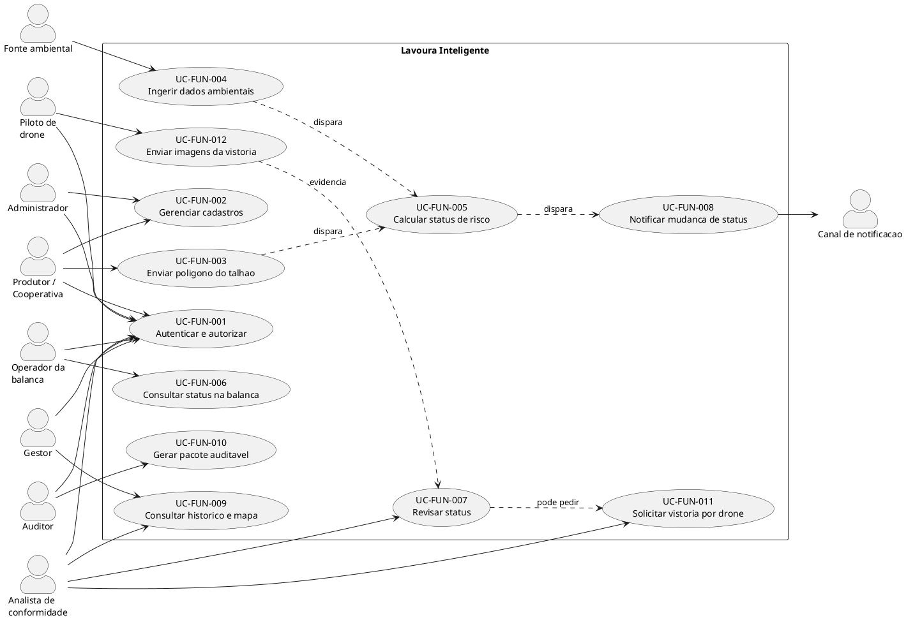

# Casos de Uso (v2.1)

**Projeto**: Lavoura Inteligente — Rastreabilidade Agrícola e Conformidade EUDR 
**Data**: 01/10/2026 
**Status**: Em revisão

## 1. Propósito

Este documento descreve os objetivos observáveis dos usuários e dos sistemas externos.
Atividades de provisionamento AWS ficam separadas em cenários arquiteturais, pois são
procedimentos de implantação/operação, e não casos de uso do produto.

## 2. Atores

| Ator | Responsabilidade |
| -- | -- |
| Administrador | Gerenciar usuários, perfis e parâmetros das regras. |
| Produtor / Cooperativa | Cadastrar fazendas, talhões, polígonos e documentos. |
| Analista de conformidade | Investigar e revisar talhões em REVISÃO ou BLOQUEADO; solicitar vistoria por drone. |
| Piloto de drone | Vistoriar talhões e enviar as imagens dos voos. |
| Operador da balança | Registrar lote e consultar o status na recepção. |
| Gestor | Consultar painéis e histórico. |
| Auditor | Consultar trilhas e gerar pacotes auditáveis, sem alterá-los. |
| Fonte ambiental | Fornecer alertas e camadas (MapBiomas, DETER, Sentinel). |
| Canal de notificação | Entregar mensagens de mudança de status. |

Serviços AWS são componentes internos da solução e não atores do diagrama.

## 3. Diagrama funcional

```plantuml
@startuml LavouraInteligente_CasosDeUso
left to right direction
skinparam actorStyle awesome

actor Administrador as Admin
actor "Produtor /\nCooperativa" as Prod
actor "Analista de\nconformidade" as Analista
actor "Operador da\nbalanca" as Op
actor Gestor as Gest
actor Auditor as Audit
actor "Fonte ambiental" as Fonte
actor "Canal de notificacao" as Canal
actor "Piloto de\ndrone" as Piloto

rectangle "Lavoura Inteligente" {
  usecase "UC-FUN-001\nAutenticar e autorizar" as UC1
  usecase "UC-FUN-002\nGerenciar cadastros" as UC2
  usecase "UC-FUN-003\nEnviar poligono do talhao" as UC3
  usecase "UC-FUN-004\nIngerir dados ambientais" as UC4
  usecase "UC-FUN-005\nCalcular status de risco" as UC5
  usecase "UC-FUN-006\nConsultar status na balanca" as UC6
  usecase "UC-FUN-007\nRevisar status" as UC7
  usecase "UC-FUN-008\nNotificar mudanca de status" as UC8
  usecase "UC-FUN-009\nConsultar historico e mapa" as UC9
  usecase "UC-FUN-010\nGerar pacote auditavel" as UC10
  usecase "UC-FUN-011\nSolicitar vistoria por drone" as UC11
  usecase "UC-FUN-012\nEnviar imagens da vistoria" as UC12
}

Admin --> UC1
Admin --> UC2
Prod --> UC1
Prod --> UC2
Prod --> UC3
Analista --> UC1
Analista --> UC7
Analista --> UC9
Op --> UC1
Op --> UC6
Gest --> UC1
Gest --> UC9
Audit --> UC1
Audit --> UC10
Fonte --> UC4
UC8 --> Canal
UC4 ..> UC5 : dispara
UC3 ..> UC5 : dispara
UC5 ..> UC8 : dispara
Analista --> UC11
Piloto --> UC1
Piloto --> UC12
UC7 ..> UC11 : pode pedir
UC12 ..> UC7 : evidencia
@enduml
```

Autenticação é uma precondição transversal para os atores humanos. O UC-FUN-005 é
disparado por eventos (novo polígono ou novo dataset), sem ator humano.

## 4. Especificação dos casos de uso

### UC-FUN-001 — Autenticar e autorizar usuário

| Elemento | Especificação |
| -- | -- |
| Atores | Todos os perfis humanos. |
| Precondição | Usuário ativo e cadastrado. |
| Fluxo principal | 1. Usuário informa credenciais. 2. Sistema valida credenciais e MFA quando exigido. 3. Carrega perfil e escopo. 4. Inicia sessão e registra o acesso. |
| Alternativas | Credencial inválida: recusar sem revelar o campo. Ação fora do escopo: retornar 403 e registrar. |
| Pós-condição | Sessão autenticada ou tentativa recusada e auditada. |
| Requisitos | RF-IDN-01, RF-IDN-02, RNF-SEG-03, RNF-SEG-06. |

### UC-FUN-002 — Gerenciar cadastros

| Elemento | Especificação |
| -- | -- |
| Atores | Administrador, Produtor/Cooperativa. |
| Precondição | Usuário autenticado e autorizado. |
| Fluxo principal | 1. Seleciona produtor, fazenda ou talhão. 2. Informa ou altera dados e documentos. 3. Sistema valida relações e unicidade. 4. Persiste e audita. |
| Alternativas | Referência ativa impede exclusão; sistema oferece desativação. |
| Pós-condição | Cadastro consistente e rastreável. |
| Requisitos | RF-IDN-03, RF-CAD-01, RF-CAD-02, RN-09. |

### UC-FUN-003 — Enviar polígono do talhão

| Elemento | Especificação |
| -- | -- |
| Ator | Produtor/Cooperativa. |
| Precondição | Talhão cadastrado. |
| Fluxo principal | 1. Envia arquivo KML/GeoJSON. 2. Sistema guarda o original no S3 com hash. 3. Valida formato, CRS e geometria. 4. Grava nova versão no PostGIS. 5. Publica evento "polígono atualizado". |
| Alternativas | Geometria inválida: recusar com mensagem que indica o problema; status fica REVISÃO. Arquivo repetido (mesmo hash): informar que não houve mudança. |
| Pós-condição | Nova versão do polígono disponível e análise disparada. |
| Requisitos | RF-GEO-01 a RF-GEO-04, RNF-PER-03, RNF-USA-02. |

### UC-FUN-004 — Ingerir dados ambientais

| Elemento | Especificação |
| -- | -- |
| Ator | Fonte ambiental (coleta agendada pelo EventBridge). |
| Precondição | Fonte configurada. |
| Fluxo principal | 1. Agendamento dispara a coleta. 2. Lambda baixa o dataset e calcula o hash. 3. Guarda o bruto no S3 e a camada no PostGIS. 4. Registra fonte, versão e data de referência. 5. Publica evento "novo dataset". |
| Alternativas | Dataset já processado: ignorar (idempotência). Fonte indisponível: registrar falha, tentar novamente e alarmar se passar do prazo. |
| Pós-condição | Dataset versionado e análise disparada. |
| Requisitos | RF-AMB-01 a RF-AMB-04, RNF-CON-06, RNF-OPS-06. |

### UC-FUN-005 — Calcular status de risco

| Elemento | Especificação |
| -- | -- |
| Ator | Sistema (evento de novo polígono ou novo dataset). |
| Precondição | Polígono e camadas disponíveis. |
| Fluxo principal | 1. Identifica os talhões afetados. 2. Executa a análise espacial no PostGIS. 3. Aplica as regras RN-02 a RN-05. 4. Grava STATUS e evento no DynamoDB. 5. Guarda a evidência no S3. 6. Se o status mudou, publica evento de mudança. |
| Alternativas | Falha na análise: retry e DLQ; status anterior permanece com validade. Status com revisão humana vigente: registrar novo resultado e sinalizar ao analista, sem sobrescrever a decisão. |
| Pós-condição | Status atualizado com motivo e evidência. |
| Requisitos | RF-RSK-01 a RF-RSK-04, RN-02 a RN-07, RNF-PER-02, RNF-CON-07, RNF-SEG-08. |

### UC-FUN-006 — Consultar status na balança

| Elemento | Especificação |
| -- | -- |
| Ator | Operador da balança (ou sistema da balança). |
| Precondição | Operador autenticado; talhões de origem cadastrados. |
| Fluxo principal | 1. Registra o lote e informa os talhões de origem. 2. Sistema lê o STATUS de cada talhão no DynamoDB. 3. Aplica o pior status ao lote. 4. Exibe status, motivo e data do cálculo. 5. Operador registra a decisão (aceitar/recusar). |
| Alternativas | Talhão sem status ou com status vencido: retornar REVISÃO. Sistema indisponível: seguir procedimento manual e registrar depois. |
| Pós-condição | Lote e decisão registrados e vinculados ao status consultado. |
| Requisitos | RF-LOT-01 a RF-LOT-04, RN-04, RN-08, RNF-PER-01, RNF-CAP-02, RNF-CON-02, RNF-USA-01. |

### UC-FUN-007 — Revisar status

| Elemento | Especificação |
| -- | -- |
| Ator | Analista de conformidade. |
| Precondição | Talhão em REVISÃO ou BLOQUEADO. |
| Fluxo principal | 1. Abre o talhão e vê mapa, interseções e evidências. 2. Analisa documentos e histórico. 3. Decide manter ou alterar o status. 4. Informa justificativa. 5. Sistema grava a decisão sem apagar a evidência original. |
| Alternativas | Falta informação: solicitar documento ao produtor e manter REVISÃO. Dúvida sobre o que existe no campo: solicitar vistoria por drone (UC-FUN-011) e manter REVISÃO até a imagem chegar. Vistoria recebida: analisar a imagem sobre o polígono e decidir com ela como evidência. |
| Pós-condição | Decisão humana registrada e auditável. |
| Requisitos | RF-RSK-05, RF-DRN-05, RF-DRN-06, RN-06, RNF-SEG-06. |

### UC-FUN-008 — Notificar mudança de status

| Elemento | Especificação |
| -- | -- |
| Ator | Canal de notificação. |
| Precondição | Evento de mudança de status. |
| Fluxo principal | 1. Recebe o evento. 2. Monta mensagem com talhão, status anterior, novo status e motivo. 3. Publica no SNS para os inscritos. |
| Alternativas | Evento repetido: não publicar de novo. Falha de publicação: retry e DLQ. |
| Pós-condição | Responsáveis avisados sem duplicidade. |
| Requisitos | RF-ALT-01 a RF-ALT-03, RNF-CON-07. |

### UC-FUN-009 — Consultar histórico e mapa

| Elemento | Especificação |
| -- | -- |
| Atores | Gestor, Analista de conformidade. |
| Precondição | Usuário autorizado. |
| Fluxo principal | 1. Abre o dashboard com mapa colorido por status. 2. Filtra por produtor, município, status ou período. 3. Para histórico, sistema consulta Athena sobre o S3. |
| Alternativas | Consulta muito ampla: exigir filtro de período. |
| Pós-condição | Consulta realizada sem alterar dados. |
| Requisitos | RF-HIS-01, RF-HIS-02, RNF-PER-04, RNF-PER-05. |

### UC-FUN-010 — Gerar pacote auditável

| Elemento | Especificação |
| -- | -- |
| Ator | Auditor. |
| Precondição | Auditor autenticado e autorizado. |
| Fluxo principal | 1. Seleciona produtor ou lote. 2. Sistema reúne polígonos versionados, datasets, análises, status, revisões e decisões. 3. Confere os hashes. 4. Gera o pacote no S3 e disponibiliza link temporário. |
| Alternativas | Hash divergente: interromper e alertar segurança. |
| Pós-condição | Pacote reproduzível e registro da geração. |
| Requisitos | RF-AUD-01, RF-AUD-02, RNF-CON-05, RNF-SEG-06, RNF-SEG-08. |

### UC-FUN-011 — Solicitar vistoria por drone

| Elemento | Especificação |
| -- | -- |
| Ator | Analista de conformidade. |
| Precondição | Talhão em REVISÃO. |
| Fluxo principal | 1. Analista abre o talhão e escolhe "solicitar vistoria". 2. Informa motivo e prazo. 3. Sistema registra a vistoria como SOLICITADA. 4. SNS avisa a equipe de campo. |
| Alternativas | Talhão fora de REVISÃO: recusar (RN-10). Já existe vistoria aberta: mostrar a existente em vez de criar outra. |
| Pós-condição | Vistoria pendente visível para o piloto. |
| Requisitos | RF-DRN-01, RF-DRN-02, RN-10. |

### UC-FUN-012 — Enviar imagens da vistoria

| Elemento | Especificação |
| -- | -- |
| Ator | Piloto de drone. |
| Precondição | Piloto autenticado; vistoria atribuída a ele; voo realizado. |
| Fluxo principal | 1. Piloto abre a vistoria e vê o mapa do talhão. 2. Pede o link de envio. 3. Sistema gera link temporário do S3 só para aquela vistoria. 4. Piloto envia o ortomosaico e as fotos em partes. 5. Upload concluído dispara a validação. 6. Sistema confere georreferência, data e cobertura. 7. Vistoria fica RECEBIDA e o analista é avisado. |
| Alternativas | Conexão caiu: retomar o envio de onde parou. Link expirou: pedir um novo. Imagem inválida ou cobertura abaixo de 95%: recusar com motivo; vistoria volta para pendente. Contorno do voo difere do polígono: sugerir novo contorno ao produtor (RF-DRN-07). |
| Pós-condição | Imagem validada, guardada e disponível como evidência. |
| Requisitos | RF-DRN-03, RF-DRN-04, RF-DRN-07, RN-11, RNF-PER-06, RNF-PER-07, RNF-SEG-10. |

## 5. Cenários arquiteturais

| ID | Cenário | Resultado verificável | Requisitos relacionados |
| -- | -- | -- | -- |
| CA-ARQ-001 | Provisionar rede | VPC com sub-redes privadas para RDS e Lambdas geoespaciais; VPC Endpoints. | RNF-SEG-01, RNF-SEG-04, RNF-CUS-05 |
| CA-ARQ-002 | Implantar API e frontend | API Gateway com autenticação, CloudFront + S3 com HTTPS. | RNF-PER-01, RNF-PER-04, RNF-SEG-03 |
| CA-ARQ-003 | Implantar camada geoespacial | RDS PostgreSQL + PostGIS com índices espaciais e PITR. | RNF-PER-02, RNF-CON-03 |
| CA-ARQ-004 | Implantar ingestão orientada a eventos | EventBridge, Lambdas idempotentes, S3 e DLQ. | RNF-CON-06, RNF-CON-07, RNF-OPS-06 |
| CA-ARQ-005 | Implantar status e balança | DynamoDB com chave por talhão e teste de carga do pico. | RNF-PER-01, RNF-CAP-02 a 04 |
| CA-ARQ-006 | Implantar data lake | S3 particionado em Parquet, Athena, versionamento e Object Lock. | RNF-PER-05, RNF-CON-05, RNF-CUS-03 |
| CA-ARQ-007 | Configurar segurança | TLS, KMS, Cognito/MFA, IAM, Secrets Manager e auditoria. | RNF-SEG-01 a 09 |
| CA-ARQ-008 | Configurar observabilidade e DR | Dashboards, alarmes, backup, restore e runbooks. | RNF-OPS-01 a 06, RNF-CON-03, RNF-CON-04 |
| CA-ARQ-009 | Configurar CI/CD e custos | Build estrito, testes, rollback, Budgets e estimativa. | RNF-MAN-01 a 07, RNF-CUS-01 a 05 |
| CA-ARQ-010 | Implantar recepção de imagens de drone | Link temporário, upload em partes, evento de upload concluído, Lambda de validação e lifecycle. | RNF-PER-06 a 08, RNF-SEG-10, RNF-CUS-06 |

## 6. Matriz de rastreabilidade

| Objetivo da visão | Requisitos funcionais | RNFs principais | Caso/cenário |
| -- | -- | -- | -- |
| Acesso controlado | RF-IDN-01 a 03 | RNF-SEG-03, RNF-SEG-06 | UC-FUN-001; CA-ARQ-007 |
| Cadastro confiável | RF-CAD-01, RF-CAD-02 | RNF-SEG-07 | UC-FUN-002 |
| Polígonos válidos | RF-GEO-01 a 04 | RNF-PER-03, RNF-USA-02 | UC-FUN-003; CA-ARQ-003 |
| Dados ambientais | RF-AMB-01 a 04 | RNF-CON-06, RNF-OPS-06 | UC-FUN-004; CA-ARQ-004 |
| Status de risco | RF-RSK-01 a 05 | RNF-PER-02, RNF-CON-07, RNF-SEG-08 | UC-FUN-005, UC-FUN-007 |
| Decisão na balança | RF-LOT-01 a 04 | RNF-PER-01, RNF-CAP-02, RNF-CON-02 | UC-FUN-006; CA-ARQ-005 |
| Vistoria por drone | RF-DRN-01 a 07 | RNF-PER-06 a 08, RNF-SEG-10, RNF-CUS-06 | UC-FUN-011, UC-FUN-012; CA-ARQ-010 |
| Notificações | RF-ALT-01 a 03 | RNF-CON-07 | UC-FUN-008 |
| Histórico e mapa | RF-HIS-01, RF-HIS-02 | RNF-PER-04, RNF-PER-05 | UC-FUN-009; CA-ARQ-006 |
| Auditoria | RF-AUD-01, RF-AUD-02 | RNF-CON-05, RNF-SEG-06, RNF-SEG-08 | UC-FUN-010; CA-ARQ-007 |
| Continuidade | — | RNF-CON-01 a 04, RNF-OPS-04/05 | CA-ARQ-008 |
| Entrega e custo | — | RNF-MAN-01 a 07, RNF-CUS-01 a 05 | CA-ARQ-009 |

## 7. Histórico e aprovação

| Versão | Data | Status | Descrição | Autor(es) |
| -- | -- | -- | -- | -- |
| 1.0 | 08/09/2026 | Substituída | Casos de provisionamento arquitetural. | Joao Vitor Donda, Caique Rechuan e Joao Gabriel Meirelles |
| 1.1 | 17/09/2026 | Substituída | Casos funcionais de telemetria IoT. | Equipe do projeto |
| 2.0 | 01/10/2026 | Substituída | Casos de uso para rastreabilidade e conformidade EUDR. | Equipe do projeto |
| 2.1 | 01/10/2026 | Em revisão | Inclusão da vistoria e do mapeamento de talhões por drone. | Equipe do projeto |

| Papel aprovador | Nome | Data | Decisão |
| -- | -- | -- | -- |
| Representante de negócio | | | Pendente |
| Arquiteto de Soluções | | | Pendente |
| Professor responsável | | | Pendente |
