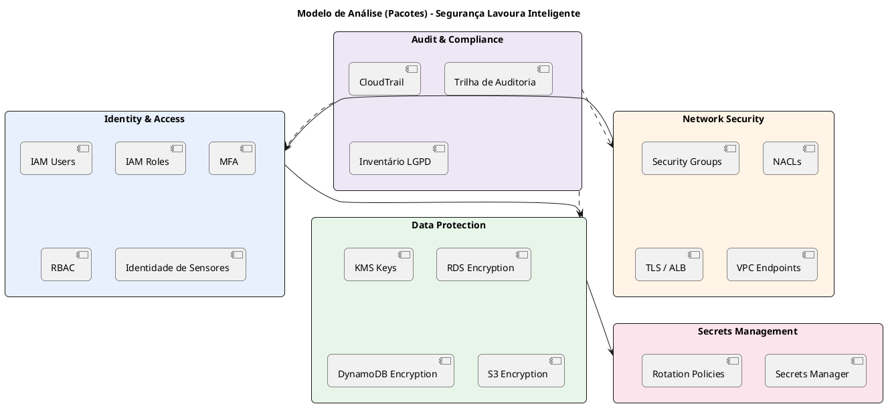
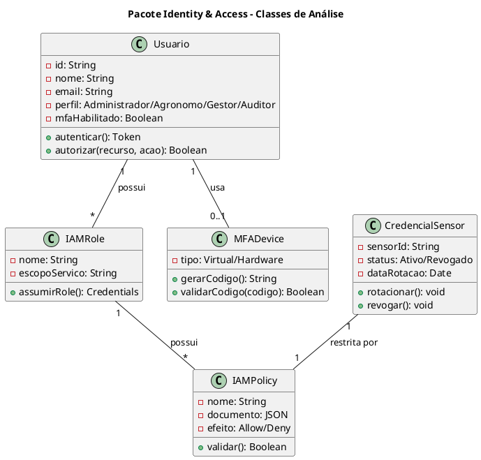
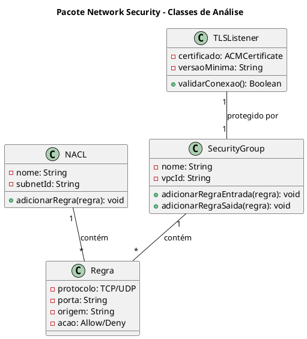
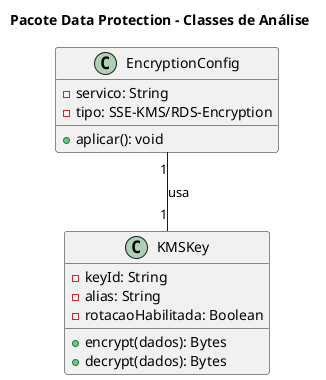
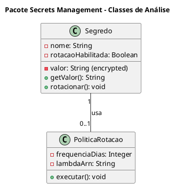
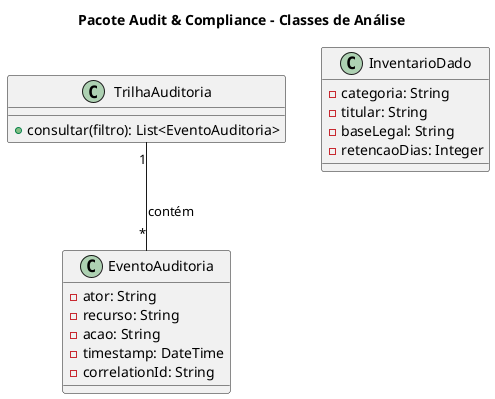

# Modelo de Análise (Pacotes de Segurança) (v1.0)

**Projeto**: Lavoura Inteligente — Plataforma de Telemetria Agrícola<br>
**Fase**: Elaboração<br>
**Data**: 22/09/2026<br>
**Status**: Em revisão

## 1. Introdução

### 1.1. Propósito

Este documento organiza, em pacotes coesos, os controles de segurança definidos no
Documento de Visão (seção de metas de qualidade), no Documento de Requisitos
Suplementares (RNF-SEG-01 a RNF-SEG-09) e no cenário arquitetural **CA-ARQ-007 —
Configurar segurança** do documento de Casos de Uso. O objetivo é dar rastreabilidade
entre requisito, pacote, serviço AWS e controle técnico, facilitando a implementação e a
revisão pelo responsável de segurança e pelo professor.

### 1.2. Escopo

O modelo cobre a proteção de:

- dados pessoais de administradores, agrônomos, produtores e gestores (LGPD);
- credenciais e identidade dos sensores IoT (RF-SEN-01, RNF-SEG-08);
- telemetria agrícola (umidade, acidez, temperatura, clima) em repouso e em trânsito;
- credenciais do RDS PostgreSQL e segredos de integração (ex.: provedor meteorológico);
- trilha de auditoria de ações administrativas e de segurança (RNF-SEG-06, RF-AUD-01).

Ficam fora do escopo os controles de continuidade, backup e observabilidade geral, que
pertencem ao cenário **CA-ARQ-008 — Configurar observabilidade e DR** e são tratados no
Documento de Requisitos Suplementares (RNF-OPS, RNF-CON).

### 1.3. Definições e siglas

| Sigla | Definição |
| -- | -- |
| IAM | Identity and Access Management |
| KMS | Key Management Service |
| CMK | Customer Managed Key |
| SG | Security Group |
| NACL | Network Access Control List |
| RBAC | Role-Based Access Control |
| MFA | Multi-Factor Authentication |
| LGPD | Lei Geral de Proteção de Dados |
| TLS | Transport Layer Security |
| SSE | Server-Side Encryption |
| VPC Endpoint | Ponto de acesso privado a um serviço AWS sem sair da rede da VPC |

### 1.4. Referências

- Documento de Visão — Lavoura Inteligente (v1.1), seção 7 (Metas de qualidade).
- Documento de Requisitos Suplementares — Lavoura Inteligente (v1.1), seção 6
  (Segurança e privacidade).
- Casos de Uso — Lavoura Inteligente (v1.1), seção 5 (Cenários arquiteturais,
  CA-ARQ-001, CA-ARQ-002, CA-ARQ-007).
- AWS Well-Architected Framework — Security Pillar.
- Lei Geral de Proteção de Dados (Lei nº 13.709/2018).

## 2. Visão geral dos pacotes de segurança

### 2.1. Diagrama de pacotes



### 2.2. Descrição dos pacotes

| Pacote | Responsabilidade | Serviços AWS | Requisitos atendidos |
| -- | -- | -- | -- |
| Identity & Access | Autenticar e autorizar usuários e sensores. | IAM, MFA, RBAC | RNF-SEG-03, RNF-SEG-04, RNF-SEG-08 |
| Network Security | Filtrar e proteger o tráfego de rede. | Security Groups, NACLs, ALB/TLS, VPC Endpoints | RNF-SEG-01, RNF-SEG-09 |
| Data Protection | Criptografar dados em repouso. | KMS, RDS, DynamoDB, S3 | RNF-SEG-02 |
| Secrets Management | Proteger credenciais e segredos. | Secrets Manager | RNF-SEG-05 |
| Audit & Compliance | Registrar ações e evidenciar conformidade LGPD. | CloudTrail, S3 Log Bucket | RNF-SEG-06, RNF-SEG-07 |

### 2.3. Matriz de rastreamento resumida

| Requisito | Pacote responsável | Serviço AWS | Controle |
| -- | -- | -- | -- |
| RNF-SEG-01 (TLS 1.2+) | Network Security | ALB, API Gateway, ACM | Listener HTTPS obrigatório |
| RNF-SEG-02 (criptografia em repouso) | Data Protection | KMS, RDS, DynamoDB, S3 | SSE-KMS / RDS Encryption |
| RNF-SEG-03 (MFA/RBAC) | Identity & Access | IAM | MFA obrigatório, grupos por perfil |
| RNF-SEG-04 (menor privilégio) | Identity & Access | IAM Roles/Policies | Role específica por componente |
| RNF-SEG-05 (segredos fora do código) | Secrets Management | Secrets Manager | Rotação automática |
| RNF-SEG-06 (auditabilidade) | Audit & Compliance | CloudTrail | Trilha com autor, data e correlação |
| RNF-SEG-07 (LGPD) | Audit & Compliance | CloudTrail, inventário | Base legal, minimização, retenção |
| RNF-SEG-08 (identidade de sensor revogável) | Identity & Access | IAM/credencial de sensor | Rotação e revogação individual |
| RNF-SEG-09 (anti-replay) | Network Security / Ingestão | API Gateway, Lambda | Timestamp, nonce, janela de aceitação |

## 3. Especificação dos pacotes

### 3.1. Pacote: Identity & Access

#### 3.1.1. Responsabilidade

Gerenciar identidades humanas (Administrador, Agrônomo, Gestor, Auditor) e de serviço
(EC2, Lambda, RDS), além da identidade individual e revogável de cada sensor IoT
(RF-SEN-01, RNF-SEG-08).

#### 3.1.2. Elementos do pacote

| Elemento | Descrição | Serviço AWS |
| -- | -- | -- |
| IAM Users/Groups | Usuários humanos agrupados por perfil (RBAC). | IAM |
| IAM Roles | Identidades para EC2, Lambda e RDS. | IAM Roles |
| IAM Policies | Permissões granulares por componente. | IAM Policies |
| MFA | Autenticação multifator para perfis administrativos. | IAM MFA |
| Credencial de Sensor | Identidade individual, rotacionável e revogável do sensor. | IAM/API Key gerenciada |

#### 3.1.3. Diagrama de classes de análise



#### 3.1.4. Roles e permissões (Lavoura Inteligente)

| Role | Tipo | Serviços acessados | Permissões | Justificativa |
| -- | -- | -- | -- | -- |
| Administrador | Humano | Portal completo | RBAC total, MFA obrigatório | Gestão de cadastros, sensores e limiares. |
| Agrônomo | Humano | Painel, alertas | Leitura e tratamento de alerta no escopo da fazenda | Monitorar talhões (UC-FUN-006/007). |
| Gestor agrícola | Humano | Relatórios | Somente leitura de indicadores e safras | Consolidar dados sem acessar ingestão. |
| Auditor | Humano | Trilha de auditoria | Somente leitura | RF-AUD-01, sem permissão de alteração. |
| EC2-API-Role | Serviço | RDS, Secrets Manager | Acesso mínimo à base administrativa | Django REST Framework acessa RDS. |
| Lambda-Ingestao-Role | Serviço | DynamoDB, CloudWatch Logs | PutItem restrito à tabela de telemetria | UC-FUN-005, CA-ARQ-004. |
| Lambda-Alertas-Role | Serviço | DynamoDB Streams, SNS | GetRecords + Publish | UC-FUN-007, CA-ARQ-005. |
| Lambda-Arquivamento-Role | Serviço | DynamoDB Streams, S3 | GetRecords + PutObject | CA-ARQ-006. |
| RDS-Role | Serviço | KMS | Encrypt/Decrypt | Criptografia do banco administrativo. |

#### 3.1.5. Política IAM de exemplo (Lambda-Ingestao-Role)

```json
{
  "Version": "2012-10-17",
  "Statement": [
    {
      "Sid": "DynamoDBIngestao",
      "Effect": "Allow",
      "Action": ["dynamodb:PutItem", "dynamodb:GetItem"],
      "Resource": "arn:aws:dynamodb:REGIAO:CONTA:table/telemetria"
    },
    {
      "Sid": "LogsIngestao",
      "Effect": "Allow",
      "Action": ["logs:CreateLogStream", "logs:PutLogEvents"],
      "Resource": "arn:aws:logs:REGIAO:CONTA:log-group:/lambda/ingestao:*"
    }
  ]
}
```

#### 3.1.6. Riscos e mitigações

| Risco | Mitigação |
| -- | -- |
| Credenciais de sensor compartilhadas entre dispositivos | Identidade individual por sensor (RF-SEN-01). |
| Permissões amplas em roles de serviço | Menor privilégio por componente (RNF-SEG-04). |
| Acesso administrativo sem segundo fator | MFA obrigatório para Administrador, Agrônomo, Gestor e Auditor. |
| Sensor comprometido | Revogação individual sem afetar os demais (RNF-SEG-08). |

### 3.2. Pacote: Network Security

#### 3.2.1. Responsabilidade

Filtrar o tráfego entre camadas públicas e privadas e garantir que toda comunicação
externa use TLS, conforme CA-ARQ-001 e CA-ARQ-002.

#### 3.2.2. Elementos do pacote

| Elemento | Descrição | Serviço AWS |
| -- | -- | -- |
| Security Groups | Firewall stateful por instância/serviço. | VPC |
| NACLs | Firewall stateless por sub-rede. | VPC |
| TLS/ALB | Terminação HTTPS com certificado gerenciado. | ACM + ALB |
| VPC Endpoints | Acesso privado a S3 e DynamoDB sem NAT. | VPC Gateway/Interface Endpoints |

#### 3.2.3. Diagrama de classes de análise



#### 3.2.4. Matriz de Security Groups

| Security Group | Entrada | Origem | Saída | Destino | Justificativa |
| -- | -- | -- | -- | -- | -- |
| SG-ALB | 443 | 0.0.0.0/0 | 8000 | SG-EC2 | Único ponto público, HTTPS. |
| SG-EC2 (portal) | 8000 | SG-ALB | 5432 | SG-RDS | API acessada apenas pelo ALB. |
| SG-RDS | 5432 | SG-EC2 | — | — | Banco acessível apenas pela API administrativa. |
| SG-Lambda (ingestão/alertas) | — | — | 443 | VPC Endpoints | Acesso a DynamoDB/S3/Secrets sem NAT. |

#### 3.2.5. Riscos e mitigações

| Risco | Mitigação |
| -- | -- |
| Regras permissivas (0.0.0.0/0) fora do ALB | Revisão periódica; apenas SG-ALB expõe porta pública. |
| Tráfego HTTP sem criptografia | RNF-SEG-01: apenas HTTPS/TLS 1.2+, redireciona ou recusa HTTP. |
| Replay de requisições de sensores | RNF-SEG-09: timestamp, nonce e janela de aceitação na Lambda de ingestão. |

### 3.3. Pacote: Data Protection

#### 3.3.1. Responsabilidade

Garantir que toda telemetria e dado pessoal seja criptografado em repouso, conforme
RNF-SEG-02 e a classificação de dados exigida pela LGPD.

#### 3.3.2. Elementos do pacote

| Elemento | Descrição | Serviço AWS |
| -- | -- | -- |
| KMS Keys | Chaves de criptografia gerenciadas (CMK). | KMS |
| RDS Encryption | Criptografia do banco administrativo. | RDS + KMS |
| DynamoDB Encryption | Criptografia da telemetria. | DynamoDB + KMS |
| S3 Encryption | Criptografia do arquivo histórico de safras. | S3 + KMS |

#### 3.3.3. Diagrama de classes de análise



#### 3.3.4. Matriz de criptografia

| Serviço | Em repouso | Em trânsito | Chave | Justificativa |
| -- | -- | -- | -- | -- |
| RDS PostgreSQL | AES-256 (KMS) | TLS 1.2+ | CMK dedicada | Dados de usuários e cadastros (LGPD). |
| DynamoDB | AES-256 | TLS 1.2+ | AWS Managed ou CMK | Telemetria dos sensores. |
| S3 (arquivo de safras) | SSE-KMS | TLS 1.2+ | CMK dedicada | Histórico particionado por fazenda/safra. |
| Secrets Manager | AES-256 | TLS 1.2+ | AWS Managed | Credenciais e segredos de integração. |

Backups e recuperação (RDS PITR, DynamoDB PITR) seguem a política definida no cenário
CA-ARQ-008 e no RNF-OPS-04; este pacote garante apenas que os dados protegidos por
backup já estejam criptografados na origem.

#### 3.3.5. Riscos e mitigações

| Risco | Mitigação |
| -- | -- |
| Chave comprometida | Rotação automática da CMK e revisão de política de chave. |
| Dado gravado sem criptografia | Criptografia obrigatória habilitada na definição de infraestrutura (IaC). |

### 3.4. Pacote: Secrets Management

#### 3.4.1. Responsabilidade

Impedir que credenciais e segredos apareçam em código, configuração ou logs
(RNF-SEG-05).

#### 3.4.2. Elementos do pacote

| Elemento | Descrição | Serviço AWS |
| -- | -- | -- |
| Secrets Manager | Armazenamento de segredos com rotação automática. | Secrets Manager |
| Rotation Policies | Política de rotação periódica. | Lambda + Secrets Manager |

#### 3.4.3. Diagrama de classes de análise



#### 3.4.4. Segredos gerenciados

| Segredo | Serviço | Rotação | Acesso | Justificativa |
| -- | -- | -- | -- | -- |
| rds-credentials | RDS PostgreSQL | 90 dias | EC2-API-Role | Evita credencial hardcoded na API. |
| meteo-api-key | Provedor meteorológico | Conforme contrato | Lambda de integração | RF-MET-01, RNF-OPS-07. |
| sns-canal-config | Canal de notificação de alertas | 180 dias | Lambda-Alertas-Role | Credencial do canal externo de alerta. |

#### 3.4.5. Riscos e mitigações

| Risco | Mitigação |
| -- | -- |
| Segredo em variável de ambiente ou código | Varredura do repositório; leitura só via Secrets Manager em runtime. |
| Rotação manual esquecida | Rotação automática via Lambda vinculada ao Secrets Manager. |

### 3.5. Pacote: Audit & Compliance

#### 3.5.1. Responsabilidade

Registrar toda ação crítica com autor, data e correlação (RNF-SEG-06) e sustentar a
conformidade com a LGPD (RNF-SEG-07), respondendo ao caso de uso UC-FUN-009 e ao
requisito RF-AUD-01.

#### 3.5.2. Elementos do pacote

| Elemento | Descrição | Serviço AWS |
| -- | -- | -- |
| CloudTrail | Registro de chamadas de API e ações administrativas. | CloudTrail |
| S3 Log Bucket | Armazenamento imutável da trilha. | S3 |
| Inventário LGPD | Catálogo de dados pessoais, finalidade e base legal. | Documentação interna |

#### 3.5.3. Diagrama de classes de análise



#### 3.5.4. Eventos auditados (RNF-SEG-06)

| Evento | Ator | Evidência mínima |
| -- | -- | -- |
| Login administrativo | Todos os perfis | Usuário, data/hora, resultado (sucesso/falha). |
| Alteração de limiar | Administrador | Valor anterior, novo valor, versão, aprovador. |
| Provisionamento/revogação de credencial de sensor | Administrador | Sensor afetado, ação, data/hora. |
| Alteração de permissão | Administrador | Usuário afetado, perfil anterior e novo. |
| Exclusão de cadastro | Administrador | Recurso excluído, justificativa. |

#### 3.5.5. Riscos e mitigações

| Risco | Mitigação |
| -- | -- |
| Trilha alterável | Bucket S3 com versionamento e política de bloqueio de exclusão. |
| Inventário LGPD desatualizado | Revisão a cada ciclo de entrega, junto ao responsável de segurança. |

## 4. Dependências entre pacotes

| De | Para | Motivo |
| -- | -- | -- |
| Network Security | Identity & Access | Security Groups liberam tráfego apenas para roles/serviços autorizados. |
| Identity & Access | Data Protection | Apenas roles autorizadas usam as chaves KMS. |
| Data Protection | Secrets Management | Segredos de acesso a chaves e bancos ficam no Secrets Manager. |
| Audit & Compliance | Identity & Access | CloudTrail registra ações de usuários e roles IAM. |
| Audit & Compliance | Network Security | CloudTrail registra alterações em Security Groups e NACLs. |
| Audit & Compliance | Data Protection | CloudTrail registra uso e alteração de chaves KMS. |

## 5. Matriz de rastreamento completa

| Requisito | Caso/Cenário | Pacote | Serviço AWS | Controle |
| -- | -- | -- | -- | -- |
| RNF-SEG-01 | CA-ARQ-001, CA-ARQ-007 | Network Security | ACM, ALB, API Gateway | TLS 1.2+ obrigatório |
| RNF-SEG-02 | CA-ARQ-007 | Data Protection | KMS, RDS, DynamoDB, S3 | Criptografia em repouso |
| RNF-SEG-03 | UC-FUN-001, CA-ARQ-007 | Identity & Access | IAM | MFA + RBAC |
| RNF-SEG-04 | CA-ARQ-002, CA-ARQ-007 | Identity & Access | IAM Roles/Policies | Menor privilégio |
| RNF-SEG-05 | CA-ARQ-002, CA-ARQ-007 | Secrets Management | Secrets Manager | Rotação automática |
| RNF-SEG-06 | UC-FUN-009, CA-ARQ-007 | Audit & Compliance | CloudTrail | Trilha com autor/data/correlação |
| RNF-SEG-07 | UC-FUN-009, CA-ARQ-007 | Audit & Compliance | CloudTrail, inventário | Base legal, minimização, retenção |
| RNF-SEG-08 | UC-FUN-003, CA-ARQ-004 | Identity & Access | Credencial de sensor | Rotação/revogação individual |
| RNF-SEG-09 | UC-FUN-005, CA-ARQ-004 | Network Security | API Gateway, Lambda | Timestamp, nonce, janela de aceitação |

## 6. Histórico e aprovação

| Versão | Data | Status | Descrição | Autor(es) |
| -- | -- | -- | -- | -- |
| 1.0 | 22/09/2026 | Em revisão | Versão inicial, derivada de RNF-SEG-01 a 09 e CA-ARQ-007. | Joao Vitor Donda, Caique Rechuan e Joao Gabriel Meirelles |

| Papel aprovador | Nome | Data | Decisão |
| -- | -- | -- | -- |
| Arquiteto de Soluções | | | Pendente |
| Responsável de Segurança | | | Pendente |
| Professor responsável | | | Pendente |
