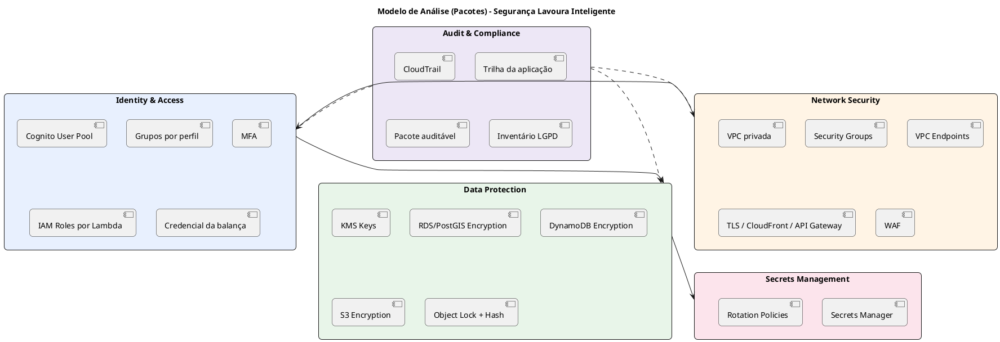
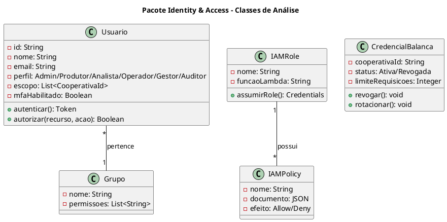
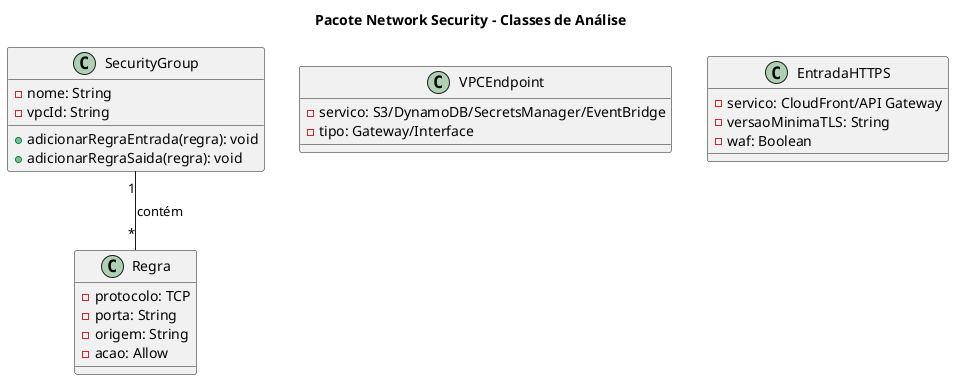
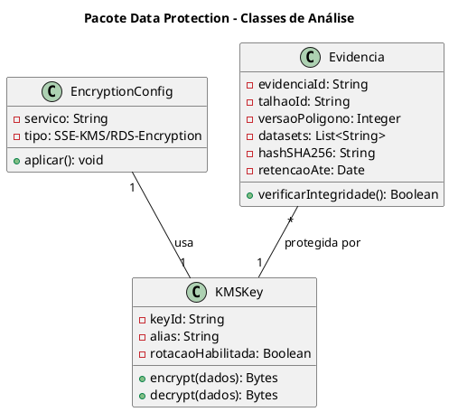
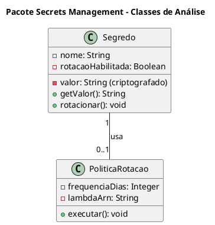
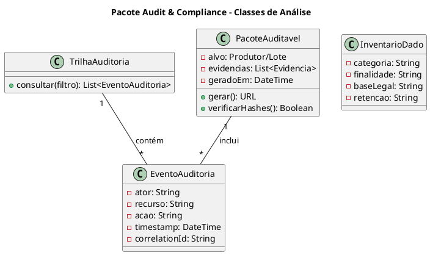

# Modelo de Análise (Pacotes de Segurança) (v2.0)

**Projeto**: Lavoura Inteligente — Rastreabilidade Agrícola e Conformidade EUDR<br>
**Fase**: Elaboração<br>
**Data**: 01/10/2026<br>
**Status**: Em revisão

## 1. Introdução

### 1.1. Propósito

Este documento organiza, em pacotes coesos, os controles de segurança definidos no
Documento de Requisitos Suplementares (RNF-SEG-01 a RNF-SEG-09) e no cenário
arquitetural **CA-ARQ-007 — Configurar segurança**. O objetivo é dar rastreabilidade
entre requisito, pacote, serviço AWS e controle técnico.

### 1.2. Escopo

O modelo cobre a proteção de:

- dados pessoais de produtores e usuários (nome, documento, contato, localização da
  propriedade), tratados segundo a LGPD;
- polígonos dos talhões e documentos de origem;
- evidências que sustentam cada status (precisam ser íntegras por no mínimo 5 anos);
- status operacional consultado na balança;
- credenciais do banco PostGIS, das fontes ambientais e da integração com a balança;
- trilha de auditoria de ações críticas.

Observabilidade geral, backup e recuperação pertencem ao cenário **CA-ARQ-008**.

### 1.3. Definições e siglas

| Sigla | Definição |
| -- | -- |
| IAM | Identity and Access Management |
| KMS | Key Management Service |
| CMK | Customer Managed Key |
| SG | Security Group |
| MFA | Multi-Factor Authentication |
| LGPD | Lei Geral de Proteção de Dados |
| TLS | Transport Layer Security |
| SSE | Server-Side Encryption |
| WAF | Web Application Firewall |
| VPC Endpoint | Acesso privado a um serviço AWS sem passar pela internet |
| Object Lock | Recurso do S3 que impede apagar ou alterar um objeto durante a retenção |

### 1.4. Referências

- Documento de Visão (v2.0) e Documento de Arquitetura (v1.0).
- Documento de Requisitos Suplementares (v2.0), seção 6.
- Casos de Uso (v2.0), cenários CA-ARQ-001 e CA-ARQ-007.
- AWS Well-Architected Framework — Security Pillar.
- Lei Geral de Proteção de Dados (Lei nº 13.709/2018).

## 2. Visão geral dos pacotes de segurança

### 2.1. Diagrama de pacotes



### 2.2. Descrição dos pacotes

| Pacote | Responsabilidade | Serviços AWS | Requisitos atendidos |
| -- | -- | -- | -- |
| Identity & Access | Autenticar usuários, autorizar por perfil e controlar permissões de serviços e da balança. | Cognito, IAM, API Gateway | RNF-SEG-03, RNF-SEG-04, RNF-SEG-09 |
| Network Security | Isolar o banco e proteger a entrada HTTPS. | VPC, Security Groups, VPC Endpoints, CloudFront, WAF | RNF-SEG-01 |
| Data Protection | Criptografar dados e garantir integridade das evidências. | KMS, RDS, DynamoDB, S3 Object Lock | RNF-SEG-02, RNF-SEG-08 |
| Secrets Management | Manter credenciais fora do código. | Secrets Manager | RNF-SEG-05 |
| Audit & Compliance | Registrar ações e evidenciar conformidade LGPD. | CloudTrail, DynamoDB, S3 | RNF-SEG-06, RNF-SEG-07 |

### 2.3. Matriz de rastreamento resumida

| Requisito | Pacote responsável | Serviço AWS | Controle |
| -- | -- | -- | -- |
| RNF-SEG-01 (TLS 1.2+) | Network Security | CloudFront, API Gateway, ACM | Somente HTTPS |
| RNF-SEG-02 (criptografia em repouso) | Data Protection | KMS, RDS, DynamoDB, S3 | SSE-KMS / RDS Encryption |
| RNF-SEG-03 (MFA e perfis) | Identity & Access | Cognito | MFA obrigatório e grupos |
| RNF-SEG-04 (menor privilégio) | Identity & Access | IAM | Role específica por Lambda |
| RNF-SEG-05 (segredos fora do código) | Secrets Management | Secrets Manager | Rotação automática |
| RNF-SEG-06 (auditabilidade) | Audit & Compliance | CloudTrail, trilha da aplicação | Autor, data e correlation ID |
| RNF-SEG-07 (LGPD) | Audit & Compliance | Inventário de dados | Finalidade, base legal, retenção |
| RNF-SEG-08 (integridade de evidências) | Data Protection | S3 Object Lock, SHA-256 | Evidência imutável e verificável |
| RNF-SEG-09 (balança autenticada) | Identity & Access | API Gateway | Credencial por cooperativa e limite de uso |

## 3. Especificação dos pacotes

### 3.1. Pacote: Identity & Access

#### 3.1.1. Responsabilidade

Gerenciar identidades humanas (Administrador, Produtor/Cooperativa, Analista, Operador
da balança, Gestor, Auditor), identidades de serviço (Lambdas) e a credencial da
integração com a balança.

#### 3.1.2. Elementos do pacote

| Elemento | Descrição | Serviço AWS |
| -- | -- | -- |
| User Pool | Cadastro e login dos usuários. | Amazon Cognito |
| Grupos por perfil | Um grupo por perfil, usado na autorização. | Cognito Groups |
| MFA | Segundo fator para perfis sensíveis. | Cognito MFA |
| Authorizer | Valida o token em cada chamada da API. | API Gateway + Cognito |
| IAM Roles | Uma role por função Lambda. | IAM |
| Credencial da balança | Chave por cooperativa com plano de uso (limite de requisições). | API Gateway Usage Plans |

#### 3.1.3. Diagrama de classes de análise



#### 3.1.4. Perfis e roles

| Perfil / Role | Tipo | Acesso | Justificativa |
| -- | -- | -- | -- |
| Administrador | Humano (MFA) | Usuários, parâmetros, integrações | Gestão da plataforma. |
| Produtor/Cooperativa | Humano | Cadastro e polígonos do seu escopo | Manter dados de origem. |
| Analista de conformidade | Humano (MFA) | Evidências e revisão de status | UC-FUN-007. |
| Operador da balança | Humano | Registro de lote e consulta de status | UC-FUN-006. |
| Gestor | Humano | Dashboard e histórico (leitura) | UC-FUN-009. |
| Auditor | Humano (MFA) | Trilhas e pacotes (somente leitura) | UC-FUN-010. |
| Lambda-Ingestao-Role | Serviço | S3 (PutObject), RDS via Secrets, EventBridge (PutEvents) | UC-FUN-003/004. |
| Lambda-Analise-Role | Serviço | RDS via Secrets, DynamoDB (PutItem), S3 evidências, EventBridge | UC-FUN-005. |
| Lambda-Status-Role | Serviço | DynamoDB (GetItem/Query), registro de lote | UC-FUN-006. |
| Lambda-Notificacao-Role | Serviço | SNS (Publish) | UC-FUN-008. |

#### 3.1.5. Política IAM de exemplo (Lambda-Status-Role)

```json
{
  "Version": "2012-10-17",
  "Statement": [
    {
      "Sid": "LerStatus",
      "Effect": "Allow",
      "Action": ["dynamodb:GetItem", "dynamodb:Query"],
      "Resource": "arn:aws:dynamodb:REGIAO:CONTA:table/status-talhoes"
    },
    {
      "Sid": "RegistrarLote",
      "Effect": "Allow",
      "Action": ["dynamodb:PutItem"],
      "Resource": "arn:aws:dynamodb:REGIAO:CONTA:table/lotes"
    },
    {
      "Sid": "Logs",
      "Effect": "Allow",
      "Action": ["logs:CreateLogStream", "logs:PutLogEvents"],
      "Resource": "arn:aws:logs:REGIAO:CONTA:log-group:/aws/lambda/consulta-status:*"
    }
  ]
}
```

A role da consulta na balança só lê o status: ela não consegue alterar status nem
acessar o banco geoespacial.

#### 3.1.6. Riscos e mitigações

| Risco | Mitigação |
| -- | -- |
| Operador alterar status indevidamente | Perfil de operador sem permissão de escrita no status. |
| Credencial da balança vazada | Chave por cooperativa, revogável, com limite de requisições. |
| Permissões amplas em Lambdas | Role específica por função (RNF-SEG-04). |
| Conta administrativa comprometida | MFA obrigatório e alarme de login suspeito. |

### 3.2. Pacote: Network Security

#### 3.2.1. Responsabilidade

Manter o banco PostGIS fora da internet, proteger a entrada HTTPS e permitir que as
Lambdas acessem serviços AWS sem NAT Gateway.

#### 3.2.2. Elementos do pacote

| Elemento | Descrição | Serviço AWS |
| -- | -- | -- |
| VPC privada | Sub-redes privadas em duas AZs para RDS e Lambdas geoespaciais. | VPC |
| Security Groups | Firewall entre Lambdas e RDS. | VPC |
| VPC Endpoints | Gateway para S3 e DynamoDB; Interface para Secrets Manager e EventBridge. | VPC Endpoints |
| TLS | HTTPS no CloudFront e no API Gateway com certificado gerenciado. | ACM |
| WAF | Limite de requisições e regras gerenciadas na API. | AWS WAF |

#### 3.2.3. Diagrama de classes de análise



#### 3.2.4. Matriz de Security Groups

| Security Group | Entrada | Origem | Saída | Destino | Justificativa |
| -- | -- | -- | -- | -- | -- |
| SG-Lambda-Geo | — | — | 5432 | SG-RDS | Lambdas de ingestão/análise acessam o PostGIS. |
| SG-Lambda-Geo | — | — | 443 | SG-Endpoints | Acesso a Secrets Manager e EventBridge. |
| SG-RDS | 5432 | SG-Lambda-Geo | — | — | Banco acessível apenas pelas Lambdas autorizadas. |
| SG-Endpoints | 443 | SG-Lambda-Geo | — | — | Interface Endpoints privados. |

A Lambda de consulta na balança fica **fora da VPC**, pois só acessa o DynamoDB; isso
reduz latência e custo.

#### 3.2.5. Riscos e mitigações

| Risco | Mitigação |
| -- | -- |
| Banco exposto à internet | RDS sem IP público, em sub-rede privada. |
| Tráfego sem criptografia | Somente HTTPS com TLS 1.2+ (RNF-SEG-01). |
| Abuso da API / força bruta | WAF com limite de taxa e plano de uso por cooperativa. |
| Custo de NAT Gateway | VPC Endpoints para S3, DynamoDB e serviços usados. |

### 3.3. Pacote: Data Protection

#### 3.3.1. Responsabilidade

Criptografar todos os dados em repouso e garantir que as evidências usadas em um status
não possam ser alteradas nem apagadas durante a retenção.

#### 3.3.2. Elementos do pacote

| Elemento | Descrição | Serviço AWS |
| -- | -- | -- |
| KMS Keys | Chaves gerenciadas para cada camada de dados. | KMS |
| RDS Encryption | Criptografia do PostgreSQL/PostGIS e dos backups. | RDS + KMS |
| DynamoDB Encryption | Criptografia do status e dos eventos. | DynamoDB + KMS |
| S3 Encryption | Criptografia do data lake e das evidências. | S3 + KMS |
| Object Lock | Evidências imutáveis por 5 anos. | S3 Object Lock |
| Hash de integridade | SHA-256 de cada arquivo e evidência. | Lambda |

#### 3.3.3. Diagrama de classes de análise



#### 3.3.4. Matriz de criptografia

| Serviço | Em repouso | Em trânsito | Chave | Justificativa |
| -- | -- | -- | -- | -- |
| RDS PostgreSQL/PostGIS | AES-256 | TLS 1.2+ | CMK | Dados pessoais e polígonos. |
| DynamoDB | AES-256 | TLS 1.2+ | CMK | Status e eventos. |
| S3 data lake | SSE-KMS | TLS 1.2+ | CMK | Arquivos brutos e histórico. |
| S3 evidências | SSE-KMS + Object Lock | TLS 1.2+ | CMK | Integridade por 5 anos. |
| Secrets Manager | AES-256 | TLS 1.2+ | AWS Managed | Credenciais. |

#### 3.3.5. Riscos e mitigações

| Risco | Mitigação |
| -- | -- |
| Evidência alterada após a decisão | Object Lock e hash conferido no pacote auditável. |
| Chave comprometida | Rotação anual automática da CMK e política de chave restrita. |
| Dado gravado sem criptografia | Criptografia obrigatória definida na IaC. |

### 3.4. Pacote: Secrets Management

#### 3.4.1. Responsabilidade

Impedir que credenciais apareçam em código, configuração ou logs (RNF-SEG-05).

#### 3.4.2. Elementos do pacote

| Elemento | Descrição | Serviço AWS |
| -- | -- | -- |
| Secrets Manager | Armazenamento de segredos com rotação. | Secrets Manager |
| Rotation Policies | Rotação automática periódica. | Lambda + Secrets Manager |

#### 3.4.3. Diagrama de classes de análise



#### 3.4.4. Segredos gerenciados

| Segredo | Uso | Rotação | Acesso |
| -- | -- | -- | -- |
| rds-postgis-credentials | Banco geoespacial | 30 dias | Lambda-Ingestao-Role, Lambda-Analise-Role |
| fontes-ambientais-credentials | APIs de fontes que exigem login (ex.: Copernicus/Sentinel) | Conforme fornecedor | Lambda-Ingestao-Role |

As chaves da balança são gerenciadas pelos planos de uso do API Gateway (pacote
Identity & Access).

#### 3.4.5. Riscos e mitigações

| Risco | Mitigação |
| -- | -- |
| Segredo em variável de ambiente ou código | Leitura somente via Secrets Manager; varredura no CI. |
| Rotação esquecida | Rotação automática. |

### 3.5. Pacote: Audit & Compliance

#### 3.5.1. Responsabilidade

Registrar toda ação crítica com autor, data e correlação (RNF-SEG-06), sustentar a
LGPD (RNF-SEG-07) e permitir gerar o pacote auditável (UC-FUN-010).

#### 3.5.2. Elementos do pacote

| Elemento | Descrição | Serviço AWS |
| -- | -- | -- |
| CloudTrail | Registro de chamadas de API na conta AWS. | CloudTrail |
| Trilha da aplicação | Eventos de negócio (revisão, decisão na balança, alteração de polígono). | DynamoDB + S3 |
| Pacote auditável | Conjunto de evidências por produtor ou lote. | S3 |
| Inventário LGPD | Dados pessoais, finalidade, base legal e retenção. | Documentação |

#### 3.5.3. Diagrama de classes de análise



#### 3.5.4. Eventos auditados

| Evento | Ator | Evidência mínima |
| -- | -- | -- |
| Login | Todos os perfis | Usuário, data/hora, resultado. |
| Envio ou alteração de polígono | Produtor/Cooperativa | Versão anterior e nova, hash do arquivo. |
| Revisão de status | Analista | Status anterior, novo status, justificativa. |
| Decisão na balança | Operador | Lote, status consultado, decisão. |
| Alteração de permissão | Administrador | Usuário afetado, perfil anterior e novo. |
| Geração de pacote auditável | Auditor | Alvo, data, resultado da verificação de hashes. |

#### 3.5.5. Inventário LGPD (resumo)

| Dado | Titular | Finalidade | Retenção |
| -- | -- | -- | -- |
| Nome e CPF/CNPJ | Produtor | Identificar a origem do lote | Enquanto houver evidência vinculada (mínimo 5 anos) |
| Contato (e-mail/telefone) | Produtor, usuários | Notificações | Enquanto o cadastro estiver ativo |
| Localização da propriedade (polígono) | Produtor | Análise de risco | Mínimo 5 anos |
| Logs de acesso | Usuários | Segurança e auditoria | Definida na política de retenção |

#### 3.5.6. Riscos e mitigações

| Risco | Mitigação |
| -- | -- |
| Trilha alterável | Eventos copiados para S3 com Object Lock. |
| Coleta excessiva de dados pessoais | Minimização: só o necessário para identificar a origem. |
| Inventário desatualizado | Revisão a cada ciclo de entrega. |

## 4. Dependências entre pacotes

| De | Para | Motivo |
| -- | -- | -- |
| Network Security | Identity & Access | Só roles autorizadas alcançam o RDS e os endpoints. |
| Identity & Access | Data Protection | Só roles autorizadas usam as chaves KMS. |
| Data Protection | Secrets Management | Credenciais do banco ficam no Secrets Manager. |
| Audit & Compliance | Identity & Access | CloudTrail e trilha registram ações de usuários e roles. |
| Audit & Compliance | Network Security | CloudTrail registra mudanças em SGs e endpoints. |
| Audit & Compliance | Data Protection | Pacote auditável depende da integridade das evidências. |

## 5. Matriz de rastreamento completa

| Requisito | Caso/Cenário | Pacote | Serviço AWS | Controle |
| -- | -- | -- | -- | -- |
| RNF-SEG-01 | CA-ARQ-002, CA-ARQ-007 | Network Security | CloudFront, API Gateway, ACM | TLS 1.2+ |
| RNF-SEG-02 | CA-ARQ-007 | Data Protection | KMS, RDS, DynamoDB, S3 | Criptografia em repouso |
| RNF-SEG-03 | UC-FUN-001, CA-ARQ-007 | Identity & Access | Cognito | MFA e grupos |
| RNF-SEG-04 | CA-ARQ-001, CA-ARQ-007 | Identity & Access | IAM | Menor privilégio |
| RNF-SEG-05 | CA-ARQ-007 | Secrets Management | Secrets Manager | Rotação automática |
| RNF-SEG-06 | UC-FUN-007, UC-FUN-010 | Audit & Compliance | CloudTrail, DynamoDB, S3 | Trilha com autor/data/correlação |
| RNF-SEG-07 | UC-FUN-002, CA-ARQ-007 | Audit & Compliance | Inventário de dados | Base legal, minimização, retenção |
| RNF-SEG-08 | UC-FUN-005, UC-FUN-010 | Data Protection | S3 Object Lock | Hash SHA-256 e imutabilidade |
| RNF-SEG-09 | UC-FUN-006 | Identity & Access | API Gateway Usage Plans | Credencial por cooperativa |

## 6. Histórico e aprovação

| Versão | Data | Status | Descrição | Autor(es) |
| -- | -- | -- | -- | -- |
| 1.0 | 22/09/2026 | Substituída | Pacotes de segurança para telemetria IoT. | Joao Vitor Donda, Caique Rechuan e Joao Gabriel Meirelles |
| 2.0 | 01/10/2026 | Em revisão | Pacotes de segurança para rastreabilidade e conformidade EUDR. | Equipe do projeto |

| Papel aprovador | Nome | Data | Decisão |
| -- | -- | -- | -- |
| Arquiteto de Soluções | | | Pendente |
| Responsável de Segurança | | | Pendente |
| Professor responsável | | | Pendente |
